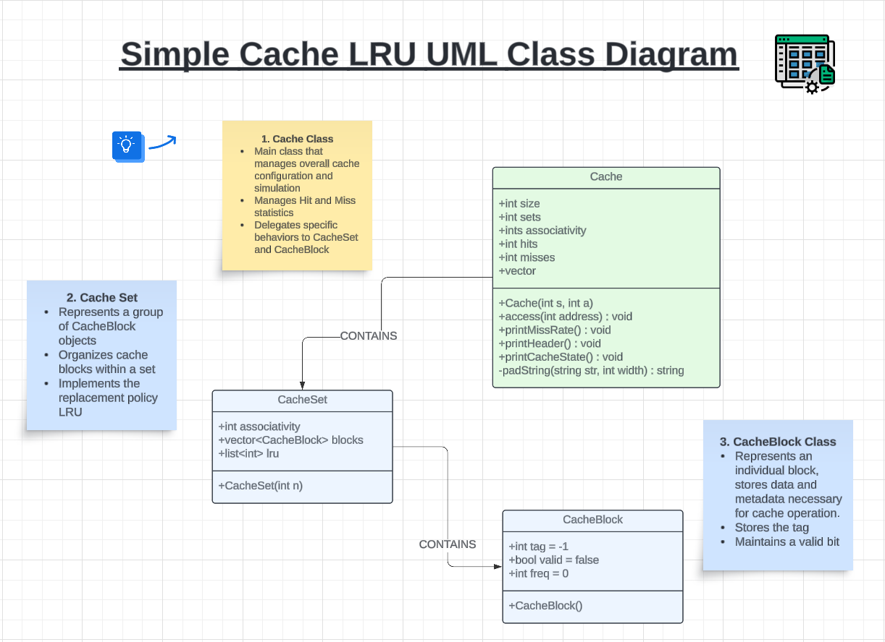
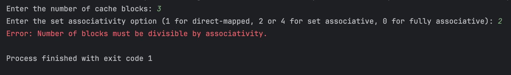
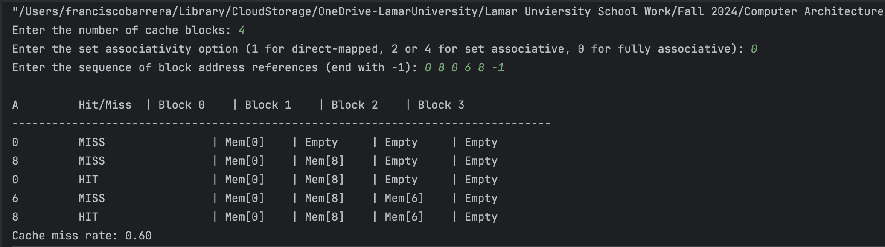

#  SIMPLE CACHE PROJECT #
Francisco Barrera.  
Computer Architecture COSC 4310.   
Instructor: Jiangjiang Liu

### OVERVIEW ###
This project serves to highlight the behavior of different types of CPU caches in handling memory access request using a LRU Policy.   
This program allows users to: 
- Configure various cache parameters, including the number of cache blocks, associativity level (direct-mapped, set-associative, or fully associative), and the replacement policy (using Least Recently Used or LRU).
- Input a sequence of memory addresses, which the program will access sequentially.
- Observe cache behavior for each memory access, including whether each access results in a cache hit or cache miss.
- Track the contents of the cache over time and calculate the final cache miss rate for the provided sequence of memory addresses.
### DEFINITIONS ###

- **Cache**: Cache memory consists of a small, fast memory that acts as a buffer for the
  DRAM memory. (The nontechnical definition of cache is a safe place for hiding
  things.) Cache is built using a different memory technology, static random access
  memory (SRAM)
- **Direct-mapping**: The simplest way to assign a
  location in the cache for each word in memory is to assign the cache location based
  on the address of the word in memory. This cache structure is called direct mapped,
  since each memory location is mapped directly to exactly one location in the cache.
- **Set-associative**: The middle range of designs between direct mapped and fully associative is called
  set associative. In a set-associative cache, there are a fixed number of locations where each block can be placed. A set-associative cache with *n* locations for a block is called an *n-way* set-associative cache. An *n-way* set-associative cache consists of a number of sets, each of which consists of *n* blocks. Each block in the memory maps to a unique set in the cache given by the index field, and a block can be placed in any element of that set.The associativity level (e.g., 2-way, 4-way) refers to the number of lines per set. Set-associative caches offer a balance between the simplicity of direct-mapped caches and the flexibility of fully associative caches.
- **Fully associative**: A scheme where a block can be place in *any* location in the cache. Because a block in meory may be associated with any entry in the cache. To find a given block in a fully associative cache, all the entries in the cache must be searched because a block can be place in any one. This is the most flexible cache type, as there are no restrictions on where a block can be placed. Fully associative caches can achieve lower miss rates, but they require more complex hardware to search for blocks, making them less feasible for large caches.
- **Least Recently Used(LRU) Policy**: A cache replacement policy that removes the cache block that has not been accessed for the longest period. This policy assumes that data accessed recently will be reused sooner than older data. The LRU policy helps improve cache efficiency by keeping frequently accessed data in the cache.
- **Cache block**: The smallest unit of data that can be stored in a cache. Each cache block contains a copy of data from a specific portion of main memory. When a memory access occurs, entire blocks are transferred between the cache and main memory rather than individual bytes or words.
- **Cache set**: A grouping of one or more cache lines in a set-associative cache. Each memory block maps to a specific set, but within that set, the block can occupy any line. The number of lines per set defines the associativity of the cache (e.g., a 2-way set-associative cache has 2 lines per set)
- **Hit/Miss**: A cache hit occurs when the requested data is found in the cache, allowing the CPU to retrieve it quickly without accessing main memory. A cache miss occurs when the requested data is not in the cache, necessitating a slower access to main memory to fetch the data.

### STRUCTURE ###
This project is structure in a way to ensure a modular and flexible design, allowing for easy experimentation with different cache configurations. It is primarily based on three classes ***Cache, CacheBlock, CacheSet*** and a main cpp file that serves as the entry point of the program.  

The following image is a UML Diagram
 
### HOW TO RUN ###
This program is written in C++, so you must make sure you have a C++ compiler installed. If you are using an IDE like **CLion** you can open the project in the IDE and set up a CMake build configuration.

If you are using GitHub, you can clone the repository and run it in your preferred IDE. 

Once you run the program, it will: 
1. Prompt you to enter the total number of cache blocks.
   2. This number is important as the number should be divisible by the associativity level (divisibility condition) For example, if you have 3 cache blocks and a 2-way set the program will print an error message like so: 
3. Prompt you to enter the associativity option (1 for direct-mapped, 2 or 4 for set associative, 0 for fully associative)
4. Prompt you to enter the memory sequence and ending it with a '-1'. 
5. Print the results in a table. 

**EXAMPLE RUN**  

